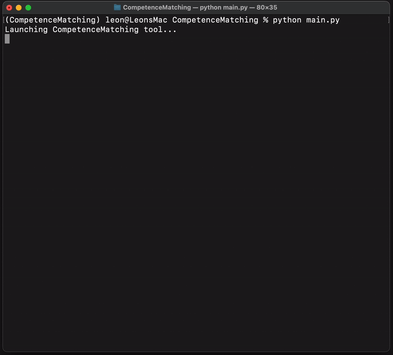

# **Competence Matching**
A tool that helps you find a job that suits you. Create a local collection of job listings, specify your requirements, and upload your resume. The system uses a local LLM to formulate a search query and filter out non-relevant listings. To find the perfect match, I developed a custom version of HyDe RAG that generates an ideal job listing based on your resume and specified requirements. Job listings are then retrieved by matching chunks of this ideal job listing. The system is lightweight and runs locally on your laptop without requiring any LLM API calls

<p align="center">
  
</p>

## **Terminal User Interface**
<p align="center">
  
</p>

To give the system a nice 80's look I made my own TUI, designed for an 80-column terminal window. It guides you through the 3 steps:
1. **Email Collection** – Load an existing collection / Create a new one / Import new listings
2. **Resume** – Load or upload a resume (`.pdf`)
3. **Matching Prompt** – Start date? / Preferred location? / Remote work? / Any role preferences?  

## **Installation**
### System setup
<details><summary>Installation</summary>
  
1. Open a terminal and clone this repository.
```bash
git clone https://github.com/Leonnorblad/CompetenceMatching
cd CompetenceMatching
```

2. Create virtual environment with python 3.11.9 e.g. conda.
```bash
conda create --name CompetenceMatching python==3.11.9
conda activate CompetenceMatching
```

3. Install the dependencies listed in `requirements.txt`.
```bash
pip install -r requirements.txt
```
4. Download [ollama 2](https://ollama.com/)
5. Open a terminal and run
```bash
ollama pull llama3.1:8b
```
You're all set! To run the CompetenceMatching app, open a terminal, navigate to the repository directory (`cd path/to/repo`) and execute `python main.py`
*The first run may take longer as the parsing models are downloaded in the background.*
</details>


### **Import job listings**
Give the system access to job listing emails by following these instructions

<details><summary>Outlook</summary>
  Using Outlook, you can export an entire inbox or folder at once.
<i>Make sure you are using the classic version of Outlook.</i>  

  <details><summary>macOS</summary>  
    <ul>  
      <li>Go to <code>Archive</code> (in the top-left corner) > <code>Export</code>.</li>  
      <li>Select <code>Email only</code> and export the folder as <code>.olm</code>.</li>  
      <li>Provide the path to the <code>.olm</code> file in the TUI.</li>  
    </ul>  
  </details>  

  <details><summary>Windows</summary>  
    <ul>  
      <li>Go to <code>Archive</code> and click on <code>Open and Export</code>.</li>  
      <li>Select <code>Import and Export</code>.</li>  
      <li>Select <code>Export to a file</code>, then <code>Next</code>.</li>  
      <li>Select <code>Comma Separated Values</code>, then <code>Next</code>.</li>  
      <li>Select a folder with job listing emails and click <code>Next</code>.</li>  
      <li>Name your file and click <code>Next</code>.</li>  
      <li>Click <code>Complete</code>.</li>  
      <li>Provide the path to the <code>.csv</code> in the TUI.</li>  
    </ul>  
  </details>  

</details>  

<details><summary>Other Email Providers</summary>  

To use any other email provider, simply download each job listing individually and place them in a folder. The process should look like this:  
<ul>  
  <li>Select the email you want to download.</li>  
  <li>Click <code>...</code> and select <code>Download message</code> to save as a <code>.eml</code> or <code>.xml</code> file.</li>  
  <li>Place all downloaded emails in a folder.</li>  
  <li>Provide the path to the folder in the TUI.</li>  
</ul>  

</details>

### **Supported formats**
One `.csv` or `.olm` file containing all emails or a folder with single emails of type `.eml`, `.xml`, `.txt` or `.pdf`.

### Configuration
If the system is slow, you can try to swapping LLM models in the `scr/config.py`. Any model supported by ollama works. Try `llama3.2.3b`.

# **System overview**
- [Email collection](#Email-collection)
- [Resume](#Resume)
- [LLM as a query writer](#LLM-as-a-query-writer)
- [Hypothetical Document Embeddings (HyDe) - simulate ideal job listing](#hypothetical-document-embeddings-hyde---simulate-ideal-job-listing)
- [Sorting and providing the best matches](#sorting-and-providing-the-best-matches)

### **Email collection**
An email collection is a vector database of chunks containing email listings. During ingestion, predefined fields are populated with structured data that is then attached as metadata to each chunk.

#### Email ingestion:
1. **Parsing**: Emails are parsed and converted to `.txt` files.
2. **Metadata Tags**: The following fields are filled during ingestion:
  - Location (city or address)
  - Role start date (YYYY-MM-DD)
  - Remote possibilities (`fully_remote` / `partly_remote` / `on_sight`)
4. **Date and location conversion** - To simplify searches, locations are converted into coordinates and the start date is transformed into Unix time format.
5. **Chunking & Indexing**: Emails are chunked and indexed in a **Chroma DB** together with their metadata tags.

#### Managing email collections:
- **Load existing collection**: Once created, users can reuse the databases for new matches, allowing them to try different requirements without reindexing the database.
- **Adding Emails**: New emails can also be added to an existing collection, avoiding duplicates by hashing each email using `md5`. This can be useful for updating an existing collection.

### **Resume**
The user's resume is summarized in an information-dense format:
1. **PDF parsing**: Resumes in PDF format are parsed using `Docling` and converted to Markdown.
2. **Section-wise summarization**: Each section of the resume is summarized independently to ensure efficient processing, especially for larger documents.
3. **Storage**: The summarized resume is saved as a `.txt`.

### LLM as a query writer
Using an LLM, the system generates database queries based on user requirements. Since it has access to the current date, you can provide natural language prompts such as:"

**User inputs:** *Max 1 km from Gallerian (Stockholm), starting on the 1st of March 2025. Or a fully remote job starting mid of June 2025.*

The LLM then figures out the query:
```bash
{'$or': [{'$and': [{'distance': {'$lte': 1}},
    {'location': 'Gallerian'},
    {'start_date': {'$gte': '2025-03-01'}}]},
  {'$and': [{'remote': 'fully_remote'},
    {'start_date': {'$gte': '2025-06-15'}}]}]}
```
The dates are converted to Unix format using `datetime` and the location are transformed to coordinates using `geopy`.
```bash
{'$or': [{'$and': [{'start_date': {'$gte': 1740783600}}, # Unix timestamp
    {'latitude': {'$gte': 59.32230058825009}}, # Min latitude
    {'latitude': {'$lte': 59.34026681174991}}, # Max latitude
    {'longitude': {'$gte': 18.049811751706045}}, # Min longitude
    {'longitude': {'$lte': 18.085034574399714}}]}, # Max longitude
  {'$and': [{'remote': 'fully_remote'},
    {'start_date': {'$gte': 1749938400}}]}]} # Unix timestamp
```
This yields an approximation of all job listings located within 1 km of Gallerian in Stockholm (red box).
<p align="center">
  
</p>

*If the user does not specify a max distance, a default of 10 km will be applied.*

### Hypothetical Document Embeddings (HyDe) - simulate ideal job listing
Based on the summary of the user's resume and specified requirements, an **ideal job listing** is generated. This generated text is designed to exhibit high semantic similarity with the best-matching job listings.

- **Resume Contribution**: The resume provides key details about the candidate's skills.
- **User Requirements**: The user's preferences (e.g., location, remote work, job type) help refine and specialize the **ideal job listing**.

For example, if the candidate is skilled in Python and the user specifies they want a full-time remote job, the ideal job description will target a role for someone proficient in Python and open to remote work. If such a role exists in the database, the ideal job description will likely show high semantic similarity to the matching job listings.

#### Chunking for improved matching
Because the ideal job listing can be long, embedding it as a whole may reduce its semantic similarity with individual vector chunks. To address this, the job description is split into smaller chunks. Each chunk is then used to retrieve relevant job listing chunks from the vector database.

### Sorting and providing the best matches
As the final step, the retrieved chunks for each chunk of the ideal job description are sorted based on similarity. The sorted results are then presented to the user in the order of their first appearance. This ensures that if multiple matching chunks belong to the same job listing, they are ranked according to the chunk with the highest similarity.

## **Local data**  
All data is stored locally in the `./user_data` folder:  

- **`email_folders/`** – Parsed emails (`.txt`)  
- **`resumes/`** – Parsed and summarized resumes (`.txt`)  
- **`results/`** – Matching results (`.txt`)  
- **`vdbs/`** – Vector databases and chunk hashes  
- **`created_databases.json`** – Collection names (`.json`)  

## **Why this architecture?**  
While semantic search can retrieve job listings that meet many desired specifications, there is a risk that certain aspects of a job listing might not align with the user's preferences. To address this, the system first filters job listings based on structured metadata (location, start date, remote options) before performing semantic similarity matching. This improves the accuracy of results by ensuring that only relevant listings are considered.

### **Limitations and trade-offs**  
- **Processing Speed** – The LLM-based query generation is resource-intensive, limiting processing speed to approximately 400 emails per hour since only one instance of the LLM can be hosted locally. Cloud-based inference could significantly improve performance.
- **Context Window Limitations** – Small models like Llama 3.1 8B perform best with short prompts, which is why resumes are summarized section by section.

## **Tech stack**  
- Llama
- Chroma
- Langchain
- geopy
- Docling
